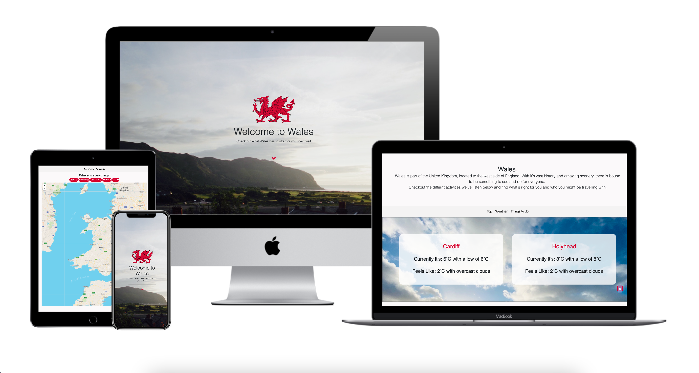
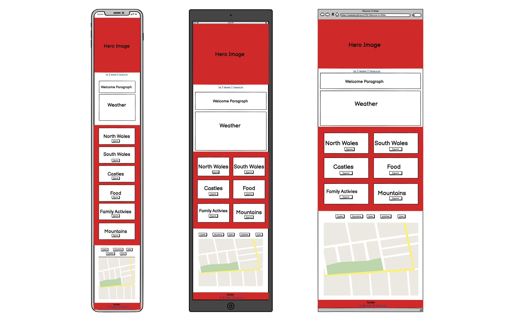
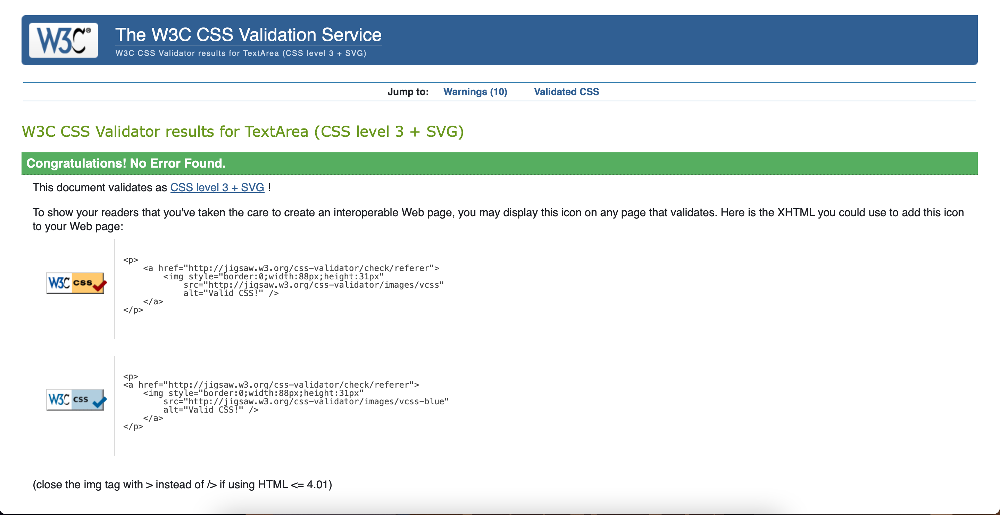

# MS2-Welcome-to-Wales
 Milestone Project #2 - a travel site for visiting Wales



## An Overview
For my second milestone project I have chosen to build a travel site for things to do in Wales. This project is built using HTML, CSS, Javascript and accompanying frameworks. Show casing mobile first design, usage of API's and a deeper dive into my current front end development knowledge with more confident use of HTML and CSS but also Javascript.
I decided on building a site for visiting Wales because I wanted an easy to view experience for anyone who's deciding on their next getaway.
This site is simplistic to use and has a good flow between different sections which tie into each-other.

In this document I will go through what I've built and why, as well as future goals and testing that's been done to make sure this site is functional in what it offers as well as across multiple device types, from mobile to desktop.

View a live version of my site [here](https://owebster.github.io/MS2-Welcome-to-Wales)

## Table of content
   * [UX](#ux) 
   * [UI](#ui)
   * [Objectives](#objectives)
      * [For The Site Owner](#for-the-site-owner)
      * [For The User](#for-the-user)
   * [Wireframe](#wireframe)
   * [Scope](#scope)
      * [Start](#start)
      * [Middle](#middle)
      * [Ongoing](#ongoing)
   * [User Stories](#user-stories)
   * [Features](#features)
   * [Technologies Used](#technologies-used)
   * [Feature and Technology Testing](#feature-and-technology-testing)
   * [Further Testing](#further-testing)
   * [Deployment](#deployment)
   * [Credits](#credits)

## UX
### The Experience:
I wanted to create a site where it’s user friendly in design and allows the user to flow explore the site easily and in a way that makes sense in terms of it's flow but to also have the most relevant information that's needed for a travel site. 
Such as the local weather, things to do in the area and also a bit of history to provide a site that's to everyone's tastes. Or map markers holding information about it’s marked place to provide more detail. I've made sure each button is working accordingly as well as having a site that's accessible to all and meets the speed requirements a user expects on a modern site (more on speed and accessibility in the testing section).

### Journey of the Site:
The site starts off with a full page image of the coast lines of North Wales with a title and short description on the what the site will offer. This gives the user a clear understanding on what the site offers. Meaning that without any further interaction they will know that it is a website to showcase some quick details on Wales.

   * From hero image on at the top, the user can either scroll with their mouse or finger to the next section of the site or they can click the down arrow which guides the user down as well.

   * The user is then greeted with a short paragraph about Wales, giving a quick description about Wales and it's location (more on why this matters in "site owner goals" ).
   
   * Following the welcome paragraph, the user is shown the current weather in Cardiff - the capital of Wales. This is done with the Dark Sky API with some JS to inject the information onto the document. Showing an animated image of the weather for a quick and clear idea, as well as the actual temperature and a written description of the weather. E.G. Overcast.

   * After the weather section, the user is greeted with the information cards section where it starts off with 2 cards about Wales. This is sorted with Bootstrap's `col` class where the cards in mobile view are sorted by `col-12` so on smaller screen devices they are listed one on top of each-other to make sure information is not cramped next to each other and is easier to view. On  medium / large screen devices, this changes to `col-sm-6` to utilise screen that have a larger area.

   * Onto the final main section of the site which is the maps section where users can select different activities and see where in Wales they are without having to leave the site. This is integrated with the Leaflet API along with JS to make the buttons functional. For example, in the maps section there is a castle button which when the user toggles the button (using the jquery command `$(btnName).click(function(task){})`), it places map markers to show where the top castles are in Wales.
   Added in this section are also links to the relevant site for activites shown. The links are targeted with `_blank` so that they'll open in a new tab to allow users to explore more about the shown activities but also still have the original site in another tab to easily get back to.

   * The site itself features both a nav bar and a footer as well. With the navbar, I have placed it under the main hero image, meaning that it is not visible until the user scrolls down from the top. Once they have scrolled down they are then greeted with the navbar which is `sticky-top` meaning that it's at the top of the screen when ever the user is going between different sections, but not when they go back to the hero image.
   The footer shows the important navigation functions for the site for users to quickly go back to certain sections like the weather section and the activity cards section.

   * A feature that is on the site is a back to top button that appears when the user scrolls down from the top of the site, allowing the user to quickly go back to top if they wanted to.


### Colours:
For the colours of the site I based the colour scheme off the colours of the Welsh flag. I primarily used the red from the flag as accent colours to add emphasis on buttons, full stops and exclamation marks to draw the user's attention to those areas even when someone is scrolling through the website with no particular aim.
Another reason for choosing `#D50130` as the primary accent colour is also because it's a good contrast over most other colours, meaning that on an accessibility stand point, it'll be easier to identify over the "lighter" colours on the rest of the site.

## UI 
### The Interface:
The site is built to be modern and mobile first. Its features are also supported across multiple browsers. This is shown in different parts of the site:
   
   * The hero image is designed to scale on different screen sizes but still taking up the equal amount of the screen to make it feel like it's a "landing page", so weather the user arrives to the site on a mobile device or a desktop device with a larger screen, it will seem more like an app (or web app) compared to other travel sites.

   * The navbar is then visible once the user scrolls down from the hero image, and is built to be stuck to the top with `sticky-top` from bootstrap's library. Allowing users to always have the core navigation features to be present. The navbar is designed to be semi translucent to create a layering effect, so when users scroll down the page will experience the page "disappear" behind the nav-bar, which is a design feature present in some modern software. I chose to do this to offer a different feeling but to also align with newer software design present in modern smart devices and computers.

   * The weather section displays two cities in Wales in a side by side view. This allows users to get a quick idea on what the weather in Wales is like. The weather is gathered with the Openweather API that's been styled to show the information quickly yet making sure it's not just a bunch of numbers on screen like other websites show.
      * Another factor in the interface (which counts as a feature) is the "feels like" temperature as it gives more context on what people should wear whilst visiting different parts of Wales.

   * Smooth scrolling is included on the entire page even for Safari which has been included with some Javascript.

   * `col` is used throughout the page to make sure every section scales according to screensize and orientation.


## Objectives
### For the Site Owner:
* To bring more people to the website
* To raise awareness on activities in Wales
* To bring more people to Wales
* To increase the cultural awareness of the country
   

### For the User:
* To learn something new about Wales
* To find something new to do in Wales
* Assist in holiday planning 
* To assist families in finding activities to do together

## Wireframe:
For my wireframes, I used Balsamiq Wireframes to mockup and create the site in different device sizes. Shown below are the different wireframes for Mobile, Tablet and Desktop. I started with the mobile site and worked from there to scale up the design. You can click on the image for a larger size.



## Accessibility
The site was built with accessibility needs in mind. 
   * All images have the correct alt tags
   * Colours throughout the site offer contrast from on another to ensure easier readability
   * Tested with Lighthouse to improve and fix accessibility concerns

## Scope
I built this project to the schedule that was generated on the Code Institute schedule generator which is ahead of the hard deadline for this project (soft-deadline: 19th January 2021, hard-deadline: 2nd February 2021). This meant that it has been my priority to build this website to in line with my soft deadline, to ensure that I am ahead of schedule and maintain a good pace. 
Initially I had a plan to build another website for this project, based on a scheduling site. However I quickly realised that it would not meet the requirements of this assignment and therefore went to my second idea which was this travel site which I was able to incorporate more features that showed JS usage and also usage of APIs.
I am happy to report that I feel as though I have built a website that meets the criteria that was provided to me as well as utilising the knowledge I have learnt so far all with providing the timeframe even though I am studying part time.

The approach I took was by splitting the project into different sections (Start, Middle and Ongoing). 
   * By doing this I was able to plan out what I wanted to start off with on the website focusing on the basic structure and the different sections I wanted to include
   * Then in the middle I focused on the styling of the sections and on-going testing of the site to make sure what I was building functions normally in different settings
   * Finally my ongoing section is based on what I want to add in the future with any future technologies I learn

### Start
   * Research and planning.
      * First thing I did for planning was to look at other travel sites and blogs to get an idea of what there is out there and what reviews customers have had for those sites.
      * Then I laid out a basic layout of what I wanted the site in my wireframes.
      * From there I started with choosing the colour scheme for the site and what accent colours to use.
   * UI and UX planning
      * Beginning with the basic HTML layout, I laid out: 
         * The skeleton of the heading / navbar area.
         * The 4 separate articles and sections within the body (Welcome section, weather, activities section and maps section).
         * The footer of the site.
      * As usual the story is an important aspect for me when designing and building a site, so I thought about how the user would be greeted when they first open the website and how the flow of the site would work and how things tie into each-other.

### Middle
   * Content
      * I started off with place holders when designing the skeleton of the site. When basic styling was applied and I could see the near finished results of the site, I then replaced the placeholders with actual content for each section.
         * In the welcome paragraph section there is a short description of what to expect on this site as well as what to expect in Wales.
         * Then comes the weather section which shows the weather for the capital of Wales (Cardiff)
         * From there we have the activities cards which shows 6 sections consisting of a bit about North and South Wales and activities of different types for customers to explore
            * On large screen devices, the tiles are displayed side by side
            * On Small to medium screen devices, the tiles are displayed in a stacking order to make sure there's not too much information in a small screen
         * After that is the maps section which on page load shows Wales. Buttons are also present for people to click to add markers for locations of different activities.
      * Footer was added which includes basic but essential quick links back to different parts of the site

   * Styling
      * Once I had the core skeleton/layout of the site, I then moved to styling the elements.
         * As mentioned above I have chosen to use the colours of the Welsh flag for accent colours.
         * The site has a simple off-white background that allows the content above to be highlighted easier.
         * For parts of the site where acceptable, such as the hero section. I used a full page (with the use of `100vh`) image to capture the user's attention and also give them the best viewing experience of the images used to show off Wales.
   
### Ongoing
   * For the future, I would like to build in a proper booking reference for the site
      * Allowing users to search for accommodation via trip advisor within the site by typing in a city in a search field
      * Integrating a searchable maps function to plan trip durations
      * A log in site to save trip ideas / plans

## User Stories
* As a user, I expect to be able to navigate the site easily an intuitively
   * This functions correctly because I was able to navigate the site easily with provided navigation buttons and on page links. Site functionality works as expected (I can see the weather in the correct section. Activities section and buttons function correctly, which allows easy reading. Maps section shows me the right area)
* As a user I expect to be able learn something new on the site about a new country that I've not visited before
   * I was able to see new information about Wales: Like the weather in two different cities. I was able to gain new informaiton about different activites to do in Wales from the section that showed what castles there are in Wales, the food that is famous from Wales from the food section, the family activites that are avaliable from the family section
   I was also able to learn where these activites are becuase of the maps section towards the bottom on the site
* As a user I'd expect to come back to the site for inspirations on what to do in Wales (being able to see different activities)
   * I was able to do this because of the built in links on the page for the different activities, taking me to the right page to read more information. Making this site a one stop shop for everything Wales.

## Features
### Current:
* Hero image with down button welcoming users to the site
* Live weather API from openweather calling two different city's weather details on page load. 
   * Weather data also includes "feels like" temperature which is a feature to let users easily identify what the temperature actually feels like
   * Show casing two cities allows users to see the different (or similar) weather in north or south Wales
* Activities card section with individual expanding cards to show more information
* Maps section with corresponding buttons selection to showcase where different activities are within Wales
* Footer with quick action links to take users back to certain sections
* Navbar with `sticky-top` functionality to be always present for the user
   * Navbar consists of quick links for easy navigation for the user
* Back to top button that shows after scroll is initiated on page, allowing the user to be taken back up to the top of the page quickly
* "show more" buttons on activities card with jquery expanding function to review more information. This is done by a default of `display: hide;` then with jquery with a toggle function on button click to show the hidden information


### Future:
* More interactive maps area allowing user to plan transport needs to different activities
* Travel section to take users to travel site allowing them to book accommodation
* Animated video for landing page to be more eye catching (scroll movement plays video)

## Technologies used:
* HTML5
* CSS
* Javascript
   * [Jquery](https://jquery.com)
* [Bootstrap](https://getbootstrap.com/) - for structure and extra features of the site
   * `fas fa-angle-down` for down button on hero-image section
   * `fab fa-fort-awesome-alt` for castle icon on maps button
   * `fas fa-mountain` for mountain icon on maps button
   * `fas fa-tram` for slate mine icon on maps button
   * `fas fa-hiking` for activities icon on maps button
   * `fab fa-suse` for zoo icon on maps button
* [Fontawesome](https://fontawesome.com/)

## Feature and Technology Testing
### Manual testing:
|                        	| Test Case                                             	| Pass (y/n) 	| Addition Information                                                                                                                                                                                                                                  	|
|------------------------	|-------------------------------------------------------	|------------	|-------------------------------------------------------------------------------------------------------------------------------------------------------------------------------------------------------------------------------------------------------	|
| Screen Size Test       	| Mobile (small)                                        	| Y          	| Tested on multiple devices with chrome developer tools as well as physical devices. Also tested in multiple orientations to ensure consistency.                                                                                                       	|
|                        	| Tablet (medium)                                       	| Y          	| Tested on multiple devices with chrome developer tools as well as physical devices. Also tested in multiple orientations to ensure consistency.                                                                                                       	|
|                        	| Computer (large)                                      	| Y          	| Tested on multiple devices with chrome developer tools as well as physical devices. Also tested in multiple orientations to ensure consistency.                                                                                                       	|
|                        	|                                                       	|            	|                                                                                                                                                                                                                                                       	|
| Navigation Buttons     	| Scroll down button on hero image                      	| Y          	|                                                                                                                                                                                                                                                       	|
|                        	| Back to top button                                    	| Y          	| Appears correctly across device screen sizes and device types                                                                                                                                                                                         	|
|                        	|                                                       	|            	|                                                                                                                                                                                                                                                       	|
| Smooth Scrolling       	| Chrome                                                	| Y          	| Functional with `display: smooth`                                                                                                                                                                                                                     	|
|                        	| Microsoft Edge                                        	| Y          	| Functional with `display: smooth`                                                                                                                                                                                                                     	|
|                        	| Safari                                                	| Y          	| Works on safari with addition JS script                                                                                                                                                                                                               	|
|                        	|                                                       	|            	|                                                                                                                                                                                                                                                       	|
| Nav Bar                	| Sticky Top                                            	| Y          	|                                                                                                                                                                                                                                                       	|
|                        	| Scales on different device size                       	| Y          	|                                                                                                                                                                                                                                                       	|
|                        	| Page links functional                                 	| Y          	|                                                                                                                                                                                                                                                       	|
|                        	|                                                       	|            	|                                                                                                                                                                                                                                                       	|
| Weather API            	| Displays correct information                          	| Y          	| API provided by [OpenWeatherMap](https://openweathermap.org/api) Both API calls display called information correctly: - Current Weather - Lowest temperature - Feels like temperature - Weather condition (with scattered clouds, with no clouds etc) 	|
|                        	| Scales across different device screen sizes           	| Y          	| Using `@media screen and (min-width: 960px){}`  to adjust text layout on api on screens larger than mobile devices                                                                                                                                    	|
|                        	| Loads correctly on page load                          	| Y          	| Uses `window.addEventListener('load', function(){}` to call api on page load                                                                                                                                                                          	|
|                        	|                                                       	|            	|                                                                                                                                                                                                                                                       	|
| Activity Cards Section 	| Scales correctly across different device screen sizes 	| Y          	| Using bootstrap's `col` tags to change between different screen sizes. On small screen sizes, `col-12` is used, on medium and large screen devices, `col-6` is used to utilise larger screen real estate.                                             	|
|                        	| Show more buttons expands to show more information    	| Y          	| This uses Jquery's `.click()` function followed by it's `.slideToggle()` function to achieve this effect.                                                                                                                                             	|
|                          | Buttons change between show more and show less         | Y            | This is done by if statement to determin click status
|                        	| Images display correctly                              	| Y          	|                                                                                                                                                                                                                                                       	|
|                        	|                                                       	|            	|                                                                                                                                                                                                                                                       	|
| Maps API               	| Displays correctly based on set JS                    	| Y          	| Maps API is provided by [Leaflet](https://leafletjs.com)                                                                                                                                                                                              	|
|                        	| Map markers populate based on button click            	| Y*         	| *Pass based on the fact that it displays maps marker but known bug where they duplicate based on button click.                                                                                                                                        	|
|                        	|                                                       	|            	|                                                                                                                                                                                                                                                       	|
| Footer                 	| Footer links are active and functional                	| Y          	| Footer links take users back to selected sections on page with anchor tags                                                                                                                                                                            	|
|                        	|                                                       	|            	|                                                                                                                                                                                                                                                       	|
| Accessibility          	| Images                                                	| Y          	| Images all have correct alt tags for vision impaired users                                                                                                                                                                                            	|
|                        	| Google Lighthouse test (mobile)                       	| 92/100     	| Google lighthouse scores shown under [Further Testing](#further-testing) section                                                                                                                                                                      	|
|                        	| Google Lighthouse test (desktop)                      	| 92/100     	| Google lighthouse scores shown under [Further Testing](#further-testing) section                                                                                                                                                                      	|

## Further Testing:
### HTML
All HTML code has gone through https://validator.w3.org/ and no errors occur

### CSS
All CSS was tested using direct input with https://jigsaw.w3.org and no errors were returned


### JS

### Known issues
* Smooth Scrolling for Safari not working for back to top button
   * Fixed on 14th January 2020 with additional JS code within back to top button function

* Weather API failing to call
   * Fixed on the 14th January 2021 by changing API provider to get around HTTPS request issue

* Accessibility contrast issue on Nav bar causing google lighthouse to decrease accessibility score
   * Fixed on the 15th January 2021 by adjusting bootstrap navbar styling

* Maps Marker duplicating on-top of each-other when multiple button click occurs
   * Fixed on the 20th January 2021 by adding an addition function for clearing all layers, then adding this function to the `.click()`calls on each button click

* Weather section overlapping on small to medium devices
   * Fixed on 15th January 2021 by adjusting min-screen size options in style.css file

* `$("#family-txt-btn").click(function(){$(".family-txt-section").slideToggle();});` Was not functioning after adjusting UL tags in cards section
   * Fixed on the 13th January 2021 by adjusting the placement of the `#family-txt-btn` button.

* Back to weather section button in footer was not functioning
   * Fixed on the 10th January 2021 by calling the right ID tag in weather section as it was pointing to the wrong ID previously

* Back to top button styling was incorrect on mobile devices
   * Fixed on the 23rd December 2020 by adjusting css file with additional padding on button

### Chrome developer tools
When building the site, during each section I used Chrome's inspect and developer tools (such as lighthouse) to validate my work and to ensure the site worked across multiple screen sizes.
This was also used to debug any structural and styling issues on the fly

### Buttons and Links
All buttons and links have been accounted for and directs to the right source

## Deployment:
During this project, I made sure that I spent some of my time focusing on how to properly manage and deploy my project. I used my own IDE (VSCode), Github's desktop app and the IDE's (VS Code) terminal to create branches, test and deploy my code. I primarily did my work in my testing branch as I knew that I would commit to my main branch closer to the time I made my site public. Within the IDE:

I used the built in terminal to get git status, git add, git commits and git push
Within Github's desktop app:

I used to push to github and change/create branches when I wanted to test out new features / layouts. An example of this was when I was creating the hero carousel and wanted to test how different screen sizes would affect the provided images

I used Github pages to host the website I built.


## Credits:
   * [Bootstrap](https://getbootstrap.com/)
   * [ColorTools](https://www.colortools.net/color_complementary.html) for picking complementary and contrasting colours
   * My mentor Spencer for helping me along the way on my first project.
   * Everyone who had a look and commented on peer to peer code review on slack
   * [Stackoverflow](https://www.w3schools.com/howto/howto_css_center-vertical.asp) for vertically and horizontally centring a div:
   ```
   margin: 0;
    position: absolute;
    top: 50%;
    left: 50%;
    -ms-transform: translate(-50%, -50%);
    transform: translate(-50%, -50%);
   ```
   * [W3School](https://www.w3schools.com/howto/howto_css_smooth_scroll.asp) for safari smooth scrolling: 
      ``` 
      $(document).ready(function(){
      // Add smooth scrolling to all links
      $("a").on('click', function(event) {

         // Make sure this.hash has a value before overriding default behaviour
         if (this.hash !== "") {
            // Prevent default anchor click behaviour
            event.preventDefault();

            // Store hash
            var hash = this.hash;

            // Using jQuery's animate() method to add smooth page scroll
            // The optional number (800) specifies the number of milliseconds it takes to scroll to the specified area
            $('html, body').animate({
            scrollTop: $(hash).offset().top
            }, 800, function(){

            // Add hash (#) to URL when done scrolling (default click behaviour)
            window.location.hash = hash;
            });
         } // End if
      });
      });
      ```
   * [StackOVerflow](https://stackoverflow.com/questions/41256026/clear-marker-layers-leaflet) for leaflet remove layers + markers
   * [BBC-Good-Foods](https://www.bbcgoodfood.com/howto/guide/top-10-foods-try-wales) for food history and food types
   * [Favicon](https://favicon.io/emoji-favicons/flag-wales/) for favicon generator
   * [Openweather](https://openweathermap.org/current#current_JSON) for weather API
   * [Leaflet](https://leafletjs.com) for maps API
   * [W3School](https://www.w3schools.com/howto/howto_js_scroll_to_top.asp) for back to top button
   * Dev Ed on youtube for tutorial on Javascript
   * [Markdown Tables](https://www.tablesgenerator.com/markdown_tables) for generating markdown table template
   * All photographs on this site were taken by me.

### [Back to Top](#an-overview)